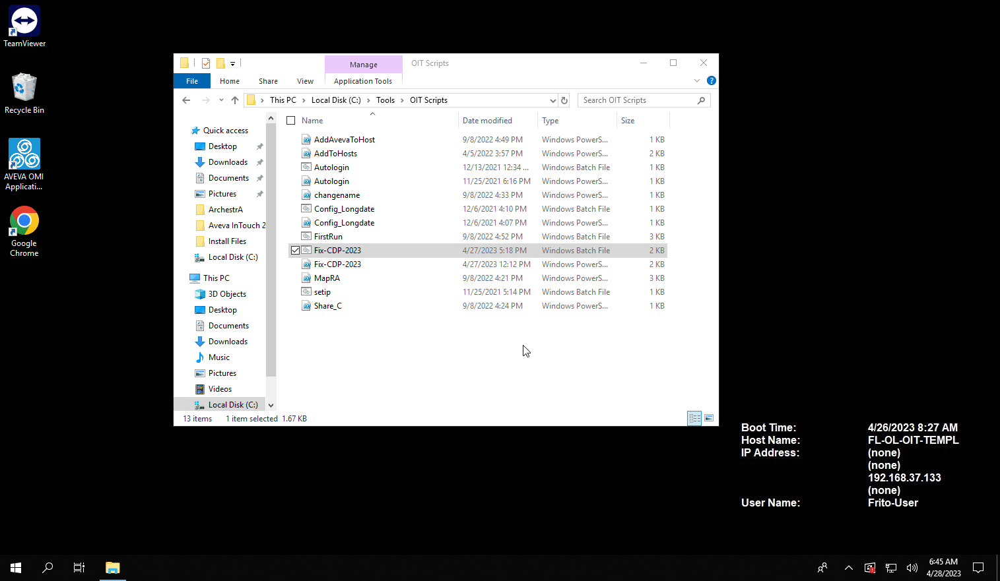

# FLNA: Upgrade CDP 2023 to 2023.1 
### NOTE: This fixes the OCMC lockup issue as described in Case # 960284510 by extracting all the content of the [CDP_2023.1.iso](https://softwaresupportsp.aveva.com/#/connectivityhub/details?id=e1af0884-b3c6-4d0f-a6b6-47507b398690) disk image onto a local folder on the OIT, and then by launching the <b><i>Silent_Install_Setup.bat</b></i> to upgrade the current version to <b><i>Communication Drivers Pack 2023.1</b></i>.
---
This workaround consists of three files:
* [Fix-CDP-2023.ps1](Fix-CDP-2023.ps1)
* [Fix-CDP-2023.bat](Fix-CDP-2023.bat)
* [CDP_2023.1.iso](https://softwaresupportsp.aveva.com/#/connectivityhub/details?id=e1af0884-b3c6-4d0f-a6b6-47507b398690)

To apply the workaround, please do:
* Save [Fix-CDP-2023.ps1](Fix-CDP-2023.ps1) and [Fix-CDP-2023.bat](Fix-CDP-2023.bat) to <b><i>C:\Tools\OIT Scripts</b></i>.
* Download the <b><i>Communication Drivers Pack 2023.1</b></i> from [AVEVA Software Support Website](https://softwaresupportsp.aveva.com/#/connectivityhub/details?id=e1af0884-b3c6-4d0f-a6b6-47507b398690)
* Save the file on the OIT's local folder. E.g., <b><i>C:\Install Files\AVEVA\CDP_2023.1.iso</i></b> [Recommended]
* If the ISO has been saved to a path different fromt he one above, edit the "Fix-CDP-2023.ps1" file and replace the path for the <i>$ISOFilePath</i>
  * E.g. <i>$ISOFilePath = "C:\Install Files\AVEVA\CDP_2023.1.iso"</i>
* Create a link to <b><i>Fix-CDP-2023.bat</b></i> and save it into the user's Startup folder  as shown below.

---
 
<i>Right-Click on Start, select Run, type <i>shell:startup</i>, and press ENTER</i>

## NOTE: The CDP upgrade may trigger a system reboot!

